# (C# 코딩) **심플 사칙연산기(SimpleCalculator)**

## 개요
- C# 프로그래밍 학습
- 1줄 소개: 사칙 연산을 수행하는 계산기 프로그램을 제작. 
- 사용한 플랫폼: 
  - C#, .NET Windows Forms, Visual Studio, GitHub
- 사용한 컨트롤 :
  - Label , TextBox , Button , ListBox
- 사용한 기술과 구현한 기능 :
 -  Visual Studio를 활용한 UI
 -  String 데이터를 int로 변환하기
 -  2개의 피연산자의 입력 값을 Int로 바꾸어 더하기 계산을 수행

## 실행 화면 (과제1)
- 과제1 코드의 실행 스크린샷


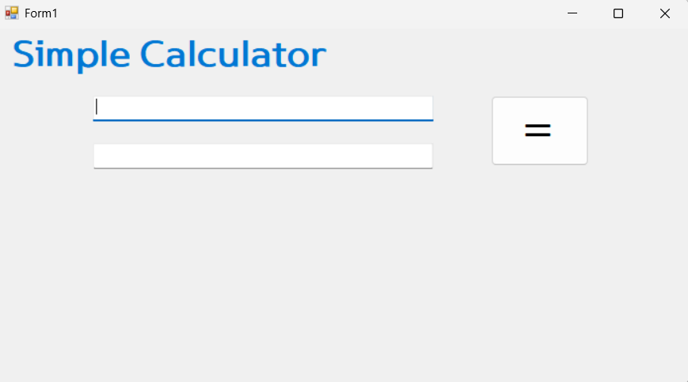
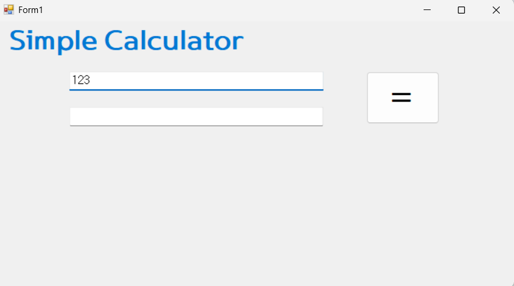
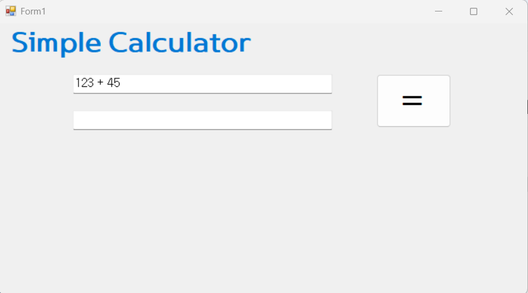
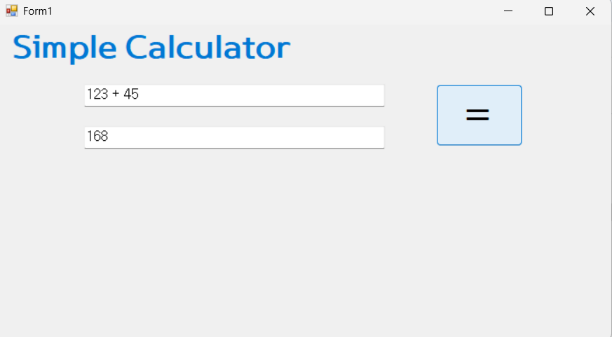

- 과제 내용
  - 2개의 `Textbox`에 입력 내용이 그대로 모두 표시됩니다.
  - Operand(피연산자)가 하나씩 표시되다가 최종적으로 결과값만 표시됩니다.
  - 컨트롤 배치와 기본적인 속성을 설정합니다.
- 구현 내용과 기능 설명
  - `TextBox` `Button` 등을 적절히 배치 하여 기본 UI를 구성합니다
  - 숫자 `Button` 클릭 시 `TextBox`에 2가지 방법으로 표시합니다..
  - 2개의 피연산자의 입력값을 Int로 바꾸어 더하기 계산을 수행하고 그 결과를 저장합니다

## 실행 화면 (과제2)
- 과제2 코드의 실행 스크린샷


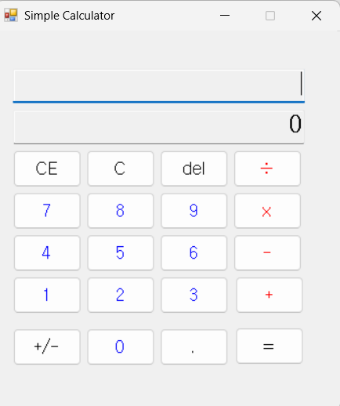
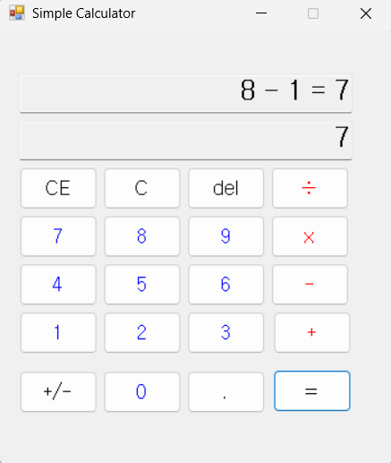
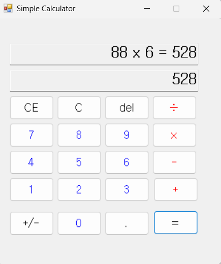
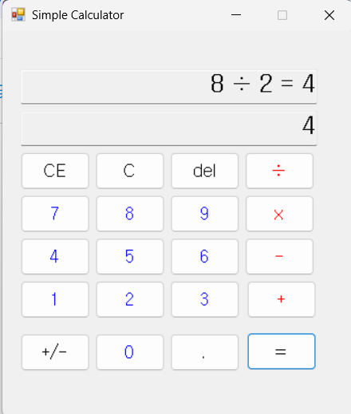

- 과제 내용
  - 각 버튼 클릭 시 연산자만 변경하여 동일 로직을 적용합니다.
  - 뺄셈(-), 곱셈(*), 나눗셈(/) 버튼을 추가하였습니다.
  - 각각의 이벤트를 연결하였습니다.
- 구현 내용과 기능 설명
  - ```csharp
    btnAdd.Click += OperatorButton_Click;
    코드가 각 버튼 클릭 시 연산자만 변경하여 동일 로직을 적용하도록 이벤트를 연결하였습니다.

  - 선택된 연산자를 `currentOperator` 변수에 저장하여 계산 로직에서 해당 연산자를 사용하도록 구현하였습니다.
  - `TextBox`에 입력된 피연산자 값을 `double`로 변환하여 계산을 수행하도록 구현하였습니다.

## 실행 화면 (과제3)
- 과제3 코드의 실행 스크린샷

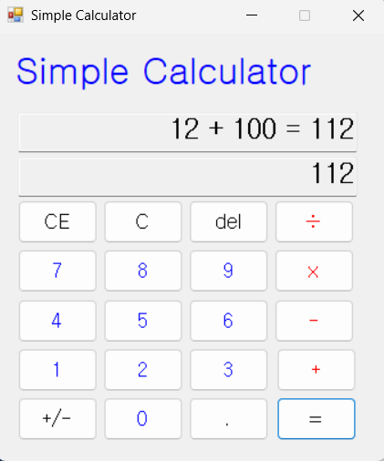
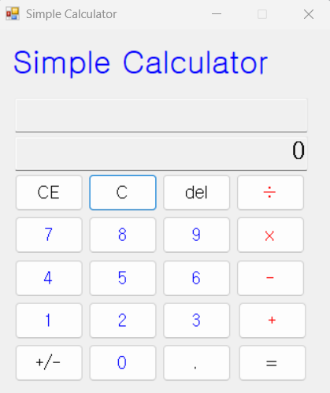
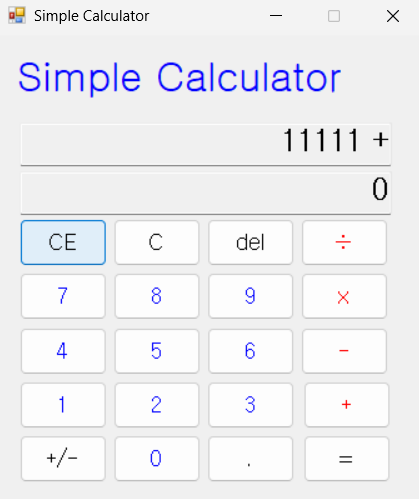
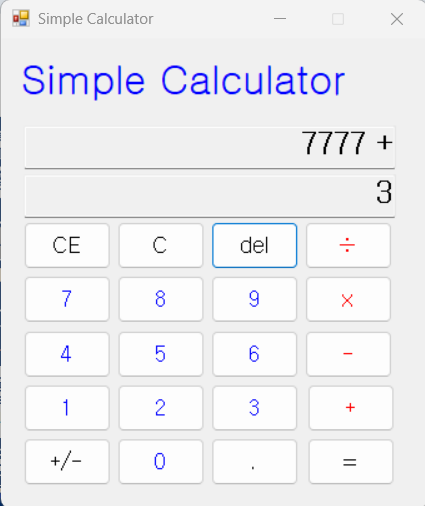

- 과제 내용
  - 계산기에 있는 내용을 수정 및 삭제 기능을 구현합니다.
  - 현재의 모든 내용을 삭제하고 처음(초기화된) 상태로 되돌아갑니다.
  - 마지막에 입력한 피연산자(Operand) 값을 삭제합니다.
  - 마지막에 입력된 글자 하나(숫자하나)값을 삭제합니다.

- 구현 내용과 기능 설명
  - `Substing` 메서드를 이용하여 문자열에서 특정 부분을 삭제하는 기능을 구현하였습니다.
  - `CE` 버튼 클릭 시 현재 입력창만 초기화되도록 구현하였습니다.
 
 ## 실행 화면 (과제4)
- 과제4 코드의 실행 스크린샷

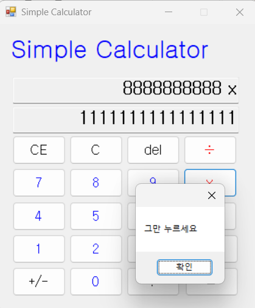
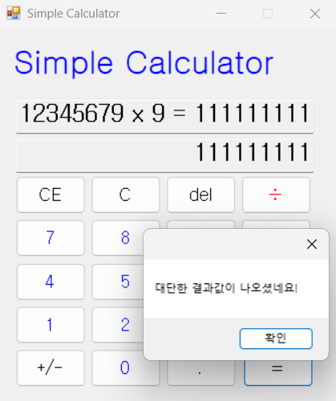
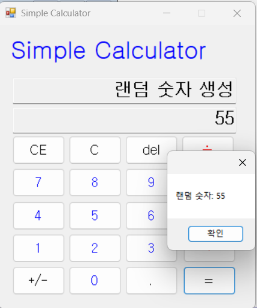
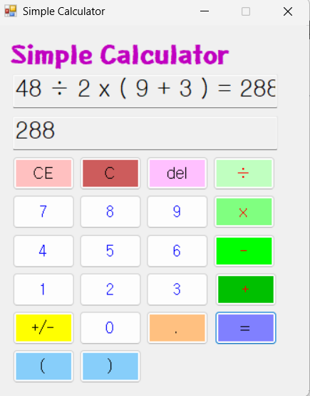


- 과제 내용
  - 쉽고 편하게 사용할 수 있도록 고민하여 기능을 추가 혹은 개선합니다
  - 키보드로 Esc, Delete, Backspace 키를 누를 시 동작 되도록 편의성 구현.
  - 계산기 트릭을 이용하여 이용자가 계산 후 숫자값의 결과가 연속적으로 나올시 메시지 창이 띄우도록 기능구현.
  - "=" 버튼 3번 클릭 시 1~100 사이의 랜덤숫자 하나를 띄어 추첨번호 기능 구현.
  - 연산자 우선순위 기능을 구현하며 곱셈/나눗셈이 덧셈/뺄셈보다 먼저 계산되도록 구현합니다.

- 구현 내용과 기능 설명
  - ```Csharp
    if (equalsClicLkedCount == 3)
    코드가 "=" 버튼 3번 클릭 시 1~100 사이의 랜덤숫자 하나를 띄어 추첨번호 기능 구현하였습니다.
  - ```csharp
    int randomNumber = random.Next(1, 101);
    코드가 1~100 사이의 랜덤숫자 하나를 생성하는 코드입니다.
  - ```csharp
    if (IsRepeatedNineDigits(formattedResult))
    코드가 같은 숫자가 9번 연속으로 나올 때 메시지 창이 띄우도록 구현하였습니다.

  - `Calculate` 메서드에서 곱셈과 나눗셈을 먼저 처리하도록 구현하였습니다.`while` 루프를 사용하여 연산자 리스트에서 곱셈과 나눗셈을 먼저 계산하고, 그 다음에 덧셈과 뺄셈을 계산하도록 하였습니다.